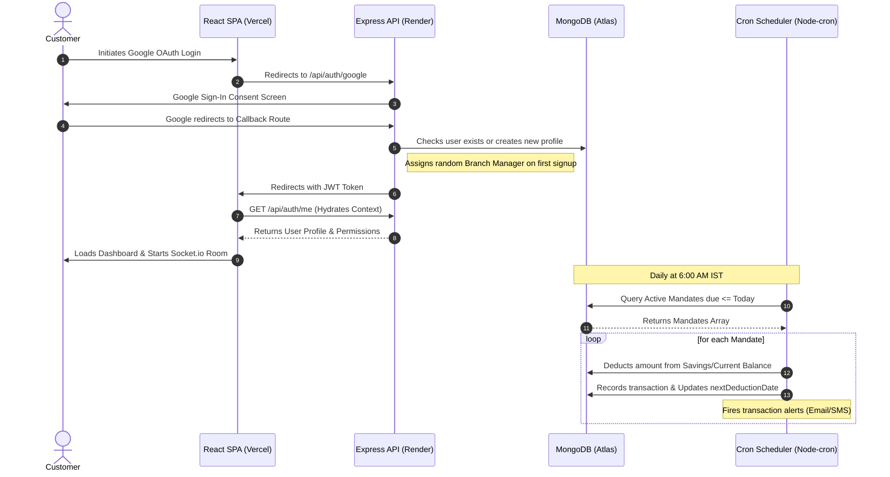

# 🏛️ VaultBank — Modern Premium Banking Platform

> A full-featured, secure, and performant MERN stack retail banking platform designed with state-of-the-art dashboards, real-time customer-manager communication, automated recurring payment mandates, and robust security safeguards.

[](https://vite.dev/)
[](https://expressjs.com/)
[](https://www.mongodb.com/)
[](https://socket.io/)
[](https://opensource.org/licenses/MIT)

---

## 📌 Overview

VaultBank is a production-grade digital banking solution that solves the complexity of modern retail bank workflows. It features distinct portals for **Customers**, **Branch Employees (Relationship Managers)**, and **Administrators(Owner)**.

Unlike standard dashboard-only banking demos, VaultBank implements active, secure banking logic:
* **Interactive Transfers**: Internal transfers and domestic NEFT/IMPS simulation with transaction approval ceilings.
* **Automated Recurring Mandates**: Standalone cron engine processing daily auto-debit payments for monthly/quarterly/yearly subscriptions.
* **Direct Real-time Chat**: Instantly connects customers with their assigned Relationship Manager using Socket.io.
* **Credit Card Hub**: Complete lifecycle simulation from credit score evaluation to credit card applications, dynamic limit assignment, usage graphing, and bill payments.

---

## 🚀 Key Features

### 👤 Customer Portal
* **Unified Financial Dashboard**: Visualize asset allocations and transaction histories using live Chart.js graphs.
* **Internal & External Transfers**: Send money between own accounts (Savings vs. Current) or transfer to beneficiaries with daily limits.
* **Recurring Mandates**: Create and manage standing instructions for merchants with automated scheduled withdrawals.
* **Credit Card Management**: Toggle card freeze states, view card statement periods, track current balance/available limit, and pay cards dynamically.
* **KYC & Profile Hub**: Complete setup options, dynamic branch manager selection, and notification preferences.

### 🧑‍💼 Employee (Relationship Manager) Portal
* **Customer Ledgers**: Search, filter, and inspect detailed profiles of assigned customers.
* **Transaction Ceilings**: Approve or reject transactions that exceed customer security thresholds.
* **Credit Card Underwriting**: Review card applications, evaluate risk, and set approved card limits.
* **Real-time Messaging**: Direct, secure communications with assigned customers.

### 👑 Admin Portal
* **Employee Management**: Onboard, suspend, or configure branch employees.
* **Branch Management**: Register physical branches, assign unique IFSC-style branch codes, and track locations.
* **Audit Trails & Security Settings**: Toggle global security policies, configure limits, and track system status.

---

## ⚙️ Tech Stack

* **Frontend**: React 19, Vite, React Router v7, Axios, Chart.js, CSS Custom Properties (Sleek Glassmorphic theme)
* **Backend**: Node.js, Express, Passport.js (Google OAuth 2.0), JSON Web Tokens (JWT), Node-cron, Nodemailer
* **Database**: MongoDB & Mongoose (Object-Document Mapper)
* **WebSockets**: Socket.io (Bi-directional real-time chat)
* **DevOps**: Vercel (Frontend), Render (Backend), GitHub Actions CI/CD

---

## 📐 System Architecture & Workflow



---

## 📂 Project Structure

```text
banking-app/
├── client/                 # React SPA (Frontend)
│   ├── src/
│   │   ├── api/            # Axios API client client.js
│   │   ├── components/     # UI Elements (Button, Card) & ChatBubble / guards
│   │   ├── context/        # AuthContext for session management
│   │   ├── hooks/          # Custom hooks (useAuth)
│   │   ├── layouts/        # DashboardLayout with Sidebar
│   │   ├── pages/          # Auth, Setup, Customer, Employee, and Admin views
│   │   ├── styles/         # Global styles and custom CSS design variables
│   │   └── main.jsx        # Client app bootloader
│   ├── vite.config.js      # Vite build configurations
│   └── vercel.json         # Vercel SPA routing rewrites
│
└── server/                 # Express API (Backend)
    ├── config/             # Database connection setup
    ├── controllers/        # Core business logic (auth, customer, employee, admin)
    ├── cron/               # Daily standing instruction mandate processing
    ├── middleware/         # Auth verification, rate-limiters, security guards
    ├── models/             # Mongoose database collections schemas
    ├── routes/             # API Router endpoints
    ├── utils/              # Email templates and notification utilities
    ├── seed.js             # Demo bank seeding script
    └── server.js           # Server runner & Socket.io handler
```

---

## 💾 Installation & Setup

### Prerequisites
* [Node.js](https://nodejs.org/) (v18 or higher recommended)
* [MongoDB](https://www.mongodb.com/try/download/community) (Local instance or MongoDB Atlas Connection String)
* Google Developer Console Account (for Google OAuth client ID/secret)

### 1. Clone the Repository
```bash
git clone https://github.com/gauribarve3/banking-app.git
cd banking-app
```

### 2. Configure the Backend Server
```bash
cd server
npm install
```
Create a `.env` file in the `server` directory (see the root [.env.example](../.env.example)).

Initialize the database with mock branches, managers, and customers:
```bash
npm run seed
```

Start the development server:
```bash
npm run dev
```

### 3. Configure the Client Frontend
Open a new terminal window:
```bash
cd client
npm install
```
Create a `.env` file in the `client` directory (see the root [.env.example](../.env.example)).

Start the client development server:
```bash
npm run dev
```

---

## 🔐 Environment Variables

### Server (`server/.env`)
```env
PORT=5000
MONGODB_URI=mongodb://localhost:27017/vaultbank
JWT_SECRET=your_jwt_signing_key_here
CLIENT_URL=http://localhost:5173

# Google OAuth Credentials
GOOGLE_CLIENT_ID=your_google_client_id.apps.googleusercontent.com
GOOGLE_CLIENT_SECRET=GOCSPX-your_google_client_secret
GOOGLE_CALLBACK_URL=http://localhost:5000/api/auth/google/callback

# Notifications Configuration (Optional)
EMAIL_SERVICE=gmail
EMAIL_USER=your_email@gmail.com
EMAIL_PASS=your_email_app_password
```

### Client (`client/.env`)
```env
VITE_API_URL=http://localhost:5000/api
```

---

## 📋 Core API Endpoints

| Category | Method | Endpoint | Description | Auth Required |
|---|---|---|---|---|
| **Auth** | POST | `/api/auth/signup` | Register a new username/password customer | No |
| **Auth** | POST | `/api/auth/login` | Login with username/password | No |
| **Auth** | GET | `/api/auth/google` | Trigger Google OAuth 2.0 redirection | No |
| **Auth** | GET | `/api/auth/google/callback` | Callback endpoint for Google Auth | No |
| **Auth** | GET | `/api/auth/me` | Fetch active user credentials | JWT |
| **Customer** | GET | `/api/customer/dashboard` | Get balance, transactions history, and POC details | JWT (Customer) |
| **Customer** | POST | `/api/customer/transfer` | Execute account-to-account or external transfer | JWT (Customer) |
| **Customer** | GET | `/api/customer/managers` | Fetch list of active Branch Managers | JWT (Customer) |
| **Customer** | POST | `/api/customer/setup-manager` | Set relationship manager for account activation | JWT (Customer) |
| **Employee** | GET | `/api/employee/customers` | Fetch ledger of assigned customers | JWT (Employee) |
| **Employee** | POST | `/api/employee/approvals/:id` | Approve/Reject transactions exceeding ceilings | JWT (Employee) |
| **Admin** | POST | `/api/admin/employees` | Create and register new employee profiles | JWT (Admin) |

---

## 🧠 Engineering Decisions & Core Mechanics

### 1. Robust Google OAuth Hard Reload
* **Problem**: Standard React Single Page App routers sometimes experience state hydration races when redirected inside client routers, causing white screens or missing contexts.
* **Decision**: We implemented a dynamic `state` token tracking pass in the OAuth request and swapped React Router's `navigate` in the callback with `window.location.href`. This triggers a hard reload that mounts the React tree cleanly with the JWT already persisted in `localStorage`.

### 2. Double-Guard Null Property Render Checks
* **Problem**: Incomplete profile attributes (like a newly created manager with no first or last name) can crash standard JS calls (like `manager.firstName[0]`), unmounting the entire React tree and presenting a blank screen to users.
* **Decision**: We implemented defensive optional chaining and fallbacks across all customer dashboards and management pages (e.g., `{poc?.firstName?.[0] || ''}`).

### 3. Automated Subscriptions Cron Engine
* **Problem**: Handling recurring billing mandates securely in node without a dedicated third-party payment gateway.
* **Decision**: We built a custom cron handler (`node-cron`) that runs daily, queries active mandates, matches customer accounts, validates limits, and processes automated balance transfers while sending transactional emails.

---

## 📄 License

This project is licensed under the MIT License. See the [LICENSE](LICENSE) file for details.
